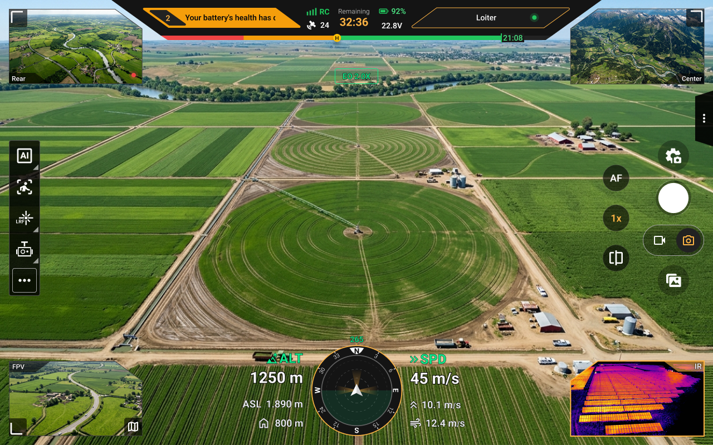
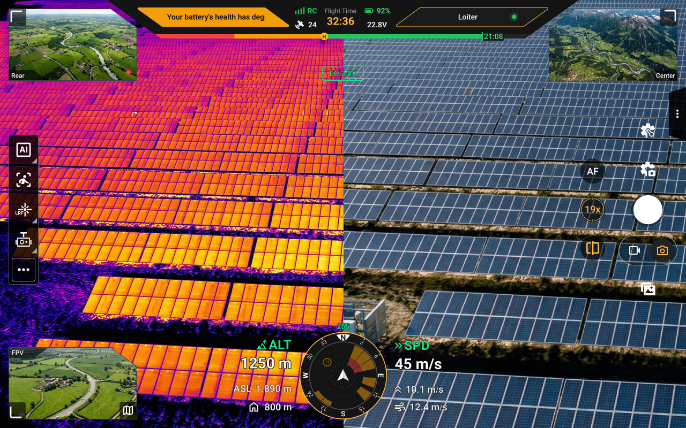
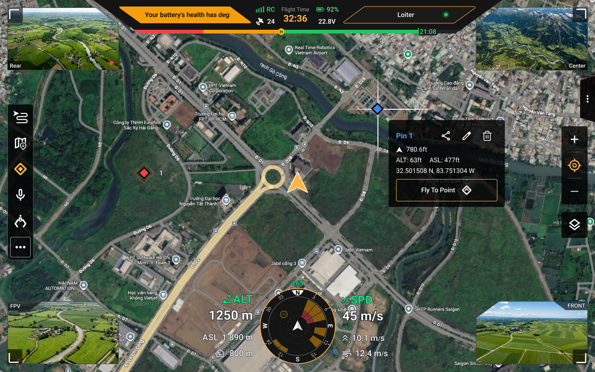
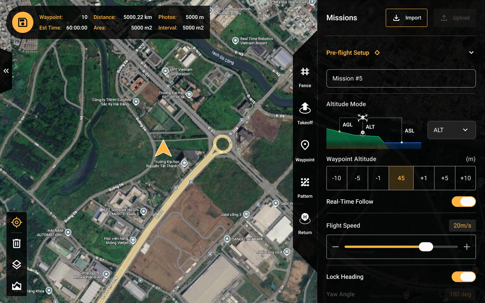
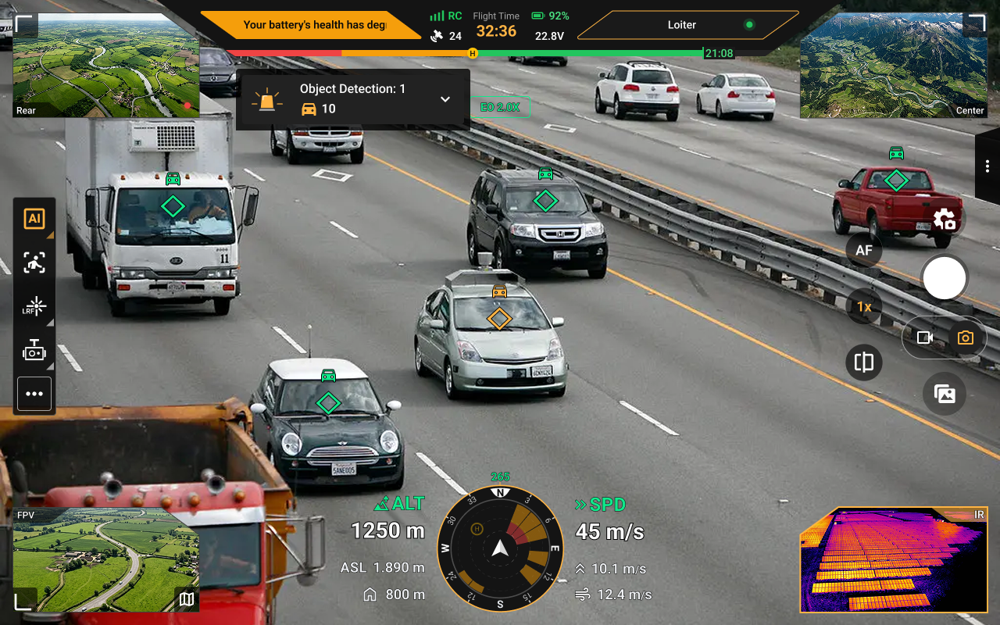
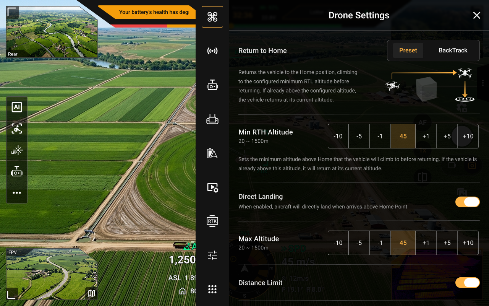

  

  <b>An integrated Ground Control Station for modern UAV operations</b> 
  Flight control · Mission planning · Situational awareness · Payload operation · AI detection · Media management

  
  
  
  
  

  
  
  
  

---

## Overview

**RAGAS** is Real-Time Robotics' professional ground control station for managing and operating UAV missions. It brings the entire flight operation into one application — from pre-flight preparation and takeoff to automated missions, live map monitoring, payload control, AI detection and tracking, and flight data management.

RAGAS provides operators with a unified interface to monitor aircraft telemetry, manage multiple payloads, plan and execute missions, and review the photos, videos, and logs generated throughout each flight.

---

## Screenshots

<table>
  <tr>
    <td align="center">
      
       <b>Payload View</b>
    </td>
    <td align="center">
      
       <b>Split View</b>
    </td>
  </tr>
  <tr>
    <td align="center">
      
       <b>Map View</b>
    </td>
    <td align="center">
      
       <b>Mission Planner</b>
    </td>
  </tr>
  <tr>
    <td align="center">
      
       <b>AI Detection</b>
    </td>
    <td align="center">
      
       <b>Settings</b>
    </td>
  </tr>
</table>

---

## Key Features

### ✈️ Fly with Confidence
Control every stage of your flight, from arming and takeoff to landing and Return to Home. Choose from six flight modes, monitor live flight data on the map and HUD, and stay informed with clear health checks, alerts and spoken notifications. Smart RTH helps you make safer return decisions based on your remaining battery and flight path.

→ [Flight guide](https://rtrobotics.gitbook.io/real-time-robotics/user-guide/flight)

### 🗺 Mission Planning & Execution
Create and fly missions with waypoints, surveys, corridor scans, structure scans, orbits and LiDAR calibration. Fine-tune altitude, speed, heading and camera actions for each step. Define operating areas and safety boundaries, preview terrain elevation, save missions to your library, and monitor progress as missions are uploaded and executed.

→ [Mission guide](https://rtrobotics.gitbook.io/real-time-robotics/user-guide/mission)

### 🌍 Map & Situational Awareness
Stay aware of everything happening around your operation with detailed maps, aircraft position, home point, routes, safety zones, pinpoints, laser targets and flight history. Search locations by name or coordinates, download maps for offline operations, and view weather, wind, obstacles and nearby Remote ID signals when supported.

→ [Map guide](https://rtrobotics.gitbook.io/real-time-robotics/user-guide/map)

### 🎥 Camera Payloads
Operate up to three payloads simultaneously from Front, Center and Rear positions. View colour and thermal feeds side by side, zoom and focus on targets, capture photos and videos, control the gimbal, measure distances with a laser range finder, and manage accessories such as spotlights and drop systems. Customise your controls for faster access during operations.

→ [Payload guide](https://rtrobotics.gitbook.io/real-time-robotics/user-guide/payload)

### 🧠 AI Detection & Tracking
Use AI to detect and track people, vehicles, animals and specialised infrastructure targets. Tap an object or draw a selection area to start tracking, while the gimbal helps keep the subject in view. Configure alerts and save important detections for later review.

→ [Detection](https://rtrobotics.gitbook.io/real-time-robotics/user-guide/detection) · [Tracking](https://rtrobotics.gitbook.io/real-time-robotics/user-guide/tracking)

### 📡 Communications & Ground Equipment
Communicate with your team using push-to-talk, group chat and voice notes. Send live or pre-recorded announcements through the aircraft speaker, control connected equipment, and customise controller buttons for quicker access to frequently used functions.

→ [Sub payload](https://rtrobotics.gitbook.io/real-time-robotics/user-guide/sub-payload)

### 🗂 Media, Evidence & Records
Access photos, videos, captures and flight records from a unified gallery. Review AI alerts with their associated details, recover supported videos, export media and logs, check storage usage, and manage PPK data for post-flight workflows.

→ [Gallery](https://rtrobotics.gitbook.io/real-time-robotics/user-guide/gallery)

### ⚙️ Configuration & Maintenance
Set up flight limits, home points, battery actions and safety preferences. Configure RTK/NTRIP and PPK workflows, calibrate sensors and controllers, test motors, manage vehicle parameters, and keep compatible payload firmware up to date.

→ [Settings](https://rtrobotics.gitbook.io/real-time-robotics/user-guide/settings)

---

  © Real-Time Robotics — RAGAS. All rights reserved.

